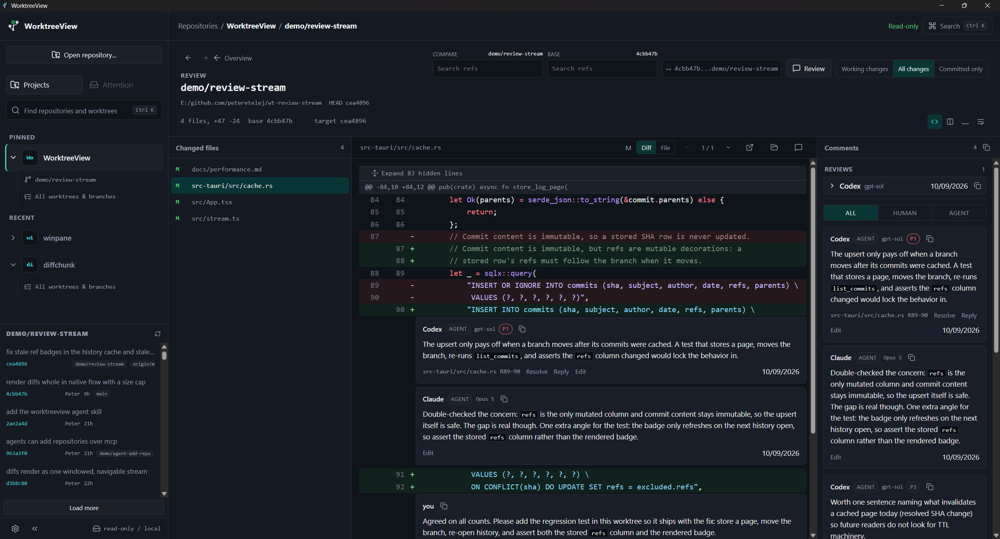

# WorktreeView

**Code review where you and your agents meet**

WorktreeView is an open-source lightweight desktop app that turns Git worktrees into a shared review inbox for humans and coding agents to collaborate on. 

Your agents join as first-class reviewers over a local API: they submit reviews, leave anchored comments, collaborate with other agents and reply in threads while you watch it all land live. 

## Features

- Lightweight, performant Code Review UI built for human devs. 
- First-class support for any AI Agent that speaks MCP (that's all of them!).
- Intuitive worktree, branch, remote branches selection and review experience.
- **Local-first**: uses `git` under the hood to access changes 
- **Read-only by design**: reviews never modify Git state. Built for reviews.
- **Collaborative API for AI Agents**: gives AI Agents a [simple API](https://github.com/peteretelej/WorktreeView/blob/main/skills/worktreeview/SKILL.md#3-operate) to use for collaboration on reviews

## Install

- **GitHub Releases**: [latest release](https://github.com/peteretelej/WorktreeView/releases/latest)
- **Microsoft Store**: _coming soon_

## Use it yourself

- Launch the app
- Add a local repository to review your worktrees, branches, remote branches.
- Illustrated user guide: [docs/user-guide.md](docs/user-guide.md).

_Collaboration with AI:_
- Copy the [worktreeview SKILL](https://github.com/peteretelej/WorktreeView/blob/main/skills/worktreeview/SKILL.md) to your AI skills (or use `npx skills add peteretelej/WorktreeView`)
- Ask your AI to setup WorktreeView integration. It will automatically configure its MCP to talk to WorktreeView.
- Ask AI to send reviews to WorktreeView or to look into feedback from other agents

_Connecting via MCP:_
- MCP setup instructions available at: [docs/connect-an-agent.md](docs/connect-an-agent.md)
- API Spec: [docs/agent-submissions.md](docs/agent-submissions.md)

## Development

Full development loop and Contributing Guide at[CONTRIBUTING.md](CONTRIBUTING.md). 

Design and architecture live in [docs/](docs/README.md).

## License

[Apache 2](LICENSE)
