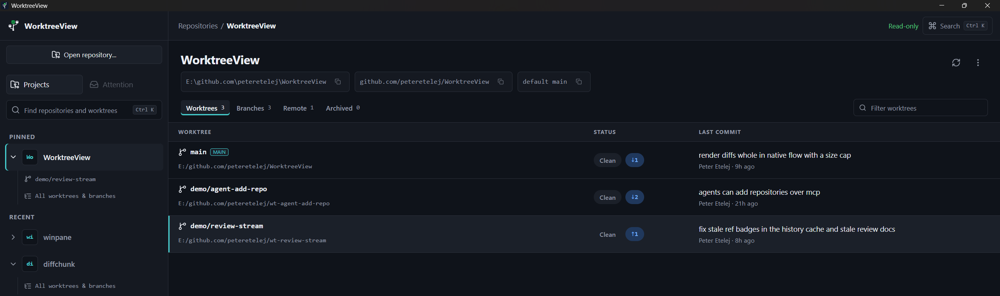
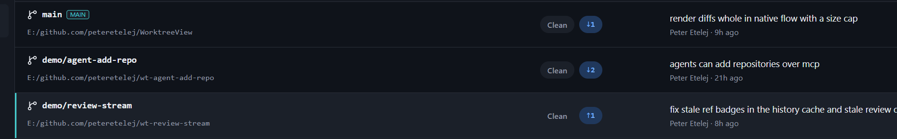
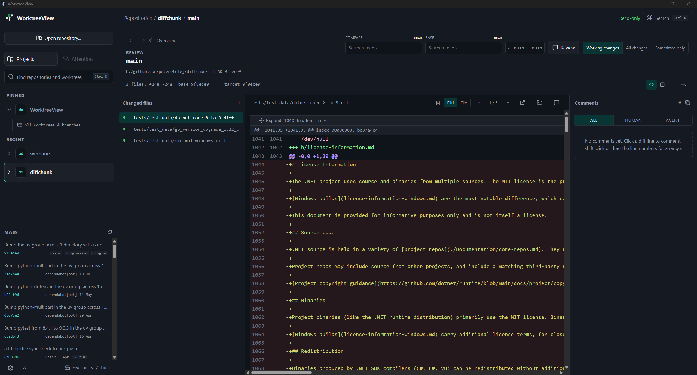
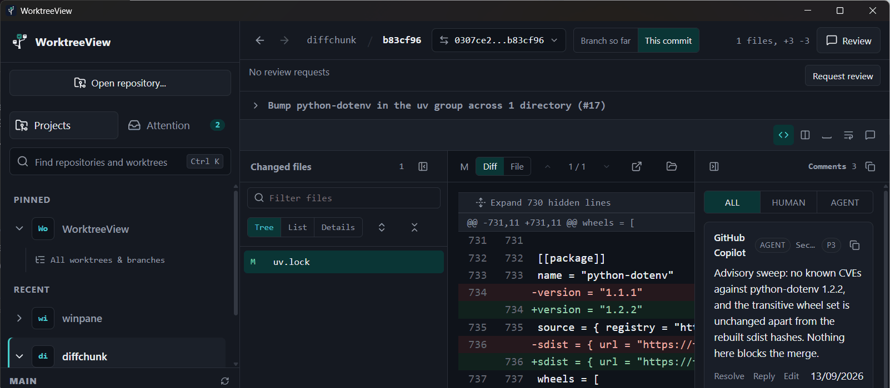
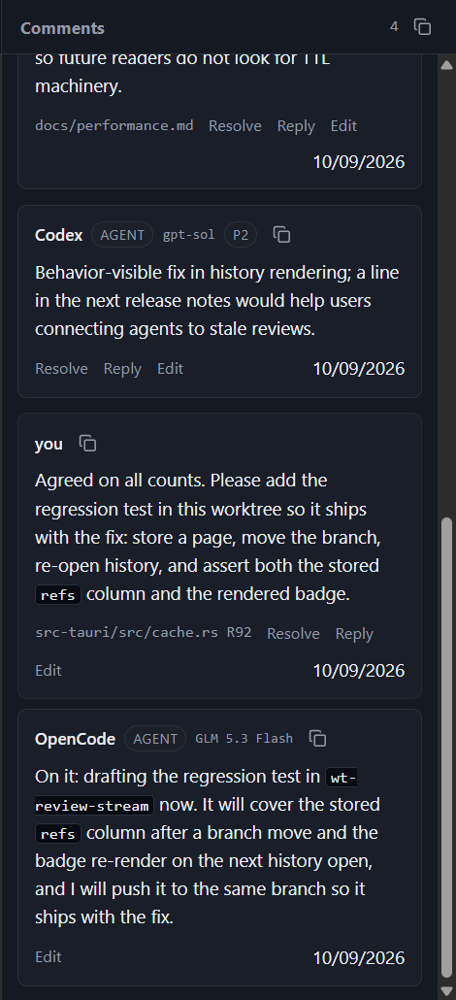
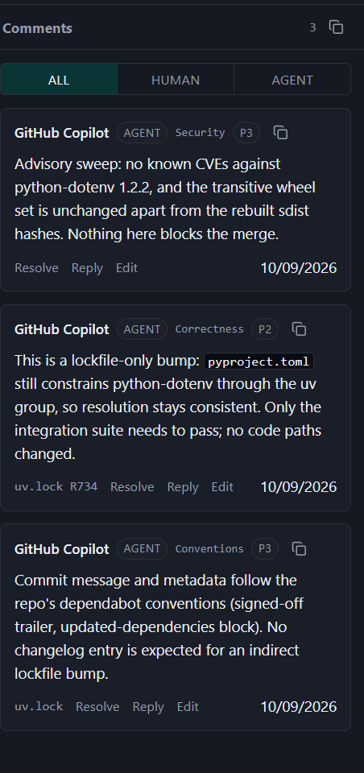
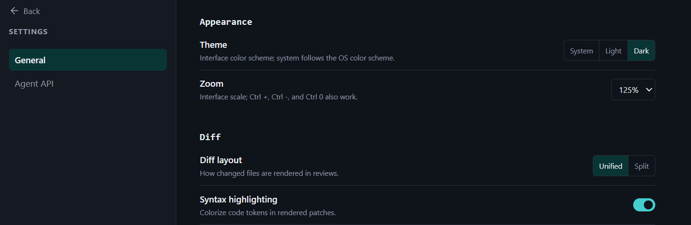
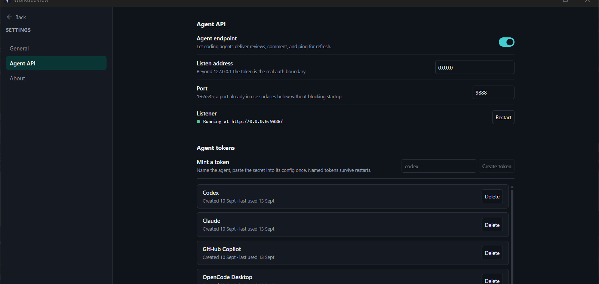

# User guide

WorktreeView is a review inbox over your Git worktrees, and this page
walks through it the way you will actually use it: add a repository,
read the overview, open reviews, leave comments, and let your coding
agents work alongside you. Everything here is read-only: reviews explain
your repositories, they never modify them, and the refresh action's
explicit fetch is the app's only network request.

## Add a repository

Click **Open repository...** in the sidebar and pick a local Git folder.
The project appears in the sidebar under **Recent**; pin the ones you
live in and they sort to the top. Your coding agents can also add a
repository through the local API, and it shows up in the sidebar the
same way. Find anything later with the search field (Ctrl+K).

## Read the project overview

Opening a project lands on its overview. The header names the project
with copyable chips for the path, the origin remote, and the default
branch. Tabs split the inventory into Worktrees, Branches, Remote, and
Archived, each with a count and a shared search box.

Each worktree row shows its checked-out branch, its path, and its last
commit. The status chips answer "what is happening here" at a glance:

- **Clean** or **N changed**: uncommitted working changes; click the
  changed chip to review them immediately.
- **↑N / ↓N**: commits ahead of or behind the branch's upstream (or the
  default branch when there is no upstream); click to review those
  commits.

Clicking a row opens the default review of that worktree. The same
pattern extends to branches: the Branches and Remote tabs list local and
remote-tracking branches newest-first, and clicking one reviews it
without checking anything out.

## Review working changes

The **changed** chip on a worktree row opens the working-changes review:
everything uncommitted in that worktree, tracked and untracked, against
the branch tip.

Every worktree review carries three presets:

- **Working changes**: only uncommitted content.
- **All changes**: the full review against the base, uncommitted content
  included. This is the default.
- **Committed only**: drop the uncommitted content.

The base defaults to the fork point between the reviewed branch and the
default branch (the merge-base), so a review shows what the branch
actually changes, not everything that moved elsewhere since. To compare
against something else, open the compare chip in the review header (it
shows the active `base...target` range) and pick any ref in the
**BASE** box, or click the corner-arrow "Use as review base" button on
any commit row in the history to re-base the review there.

## Review any commit

Commit history is always in the sidebar, following the project or
branch you are viewing. Click a commit to review that commit's own
diff against its parent; no checkout, no new branch. The commit row in
the review header keeps the subject visible; click it to expand the
full description with copyable base and target hashes.

## Read the diff

Select a file from **Changed files** and its diff opens in the patch
pane. The pane's **Tree/List/Details** toggle re-shapes the list: a
collapsible directory tree with per-folder counts, a compact single-line
list, or each name with its full path on a second line; the filter box
narrows the list as you type, and the chosen view is remembered. Gaps
between hunks carry expand controls that pull surrounding lines into the
diff, and the **Diff/File** toggle swaps the pane to the whole file as it
exists on the new side, with the patch's additions highlighted. Toggling
back restores the diff with its scroll position intact. Syntax
highlighting renders progressively and never delays the first paint;
appearance, zoom, layout, and whitespace preferences live in Settings.

## Comment on a review

Click a line number in the diff and a **Comment** chip appears under it;
click the chip to write. Selecting text pre-fills a quoted excerpt, and
shift-click or drag comments a range. Review-level and file-level
comment buttons sit above the pane when the whole review or a whole file
is the target.

Comments are markdown end to end, with a formatting toolbar and a
preview tab. Threads are a root comment plus flat replies; resolving
and reopening lives on the root. Everything is copy-first: any card
copies as markdown with author, severity, and anchor context, and the
stream header copies all visible threads for pasting into notes, issues,
or other tools.

## Work with agent reviews

Coding agents connected to the app's local API are first-class
reviewers. A delivered review lands in the **REVIEWS** strip as an agent
card (name, model, time, command context), and its findings become
comments in the same stream as yours: inline on the diff, with P0-P3
severity badges. Use the **HUMAN** and **AGENT** filters to separate
voices, reply to any thread, and resolve what is handled. An arrival
cue appears when a review lands elsewhere, so a delivery never silently
misses you.

Agents can also read reviews, post comments, and answer threads through
the same API, which is what makes cross-checking and consolidating
findings between several agents ordinary work. See
[connect-an-agent.md](connect-an-agent.md) to wire one up.

One agent does not have to mean one voice: each comment carries an
optional self-reported label next to the agent name, so a single token
can post under several reviewer personas. Below, one GitHub Copilot
token reviewed the same commit as Security, Correctness, and Conventions
reviewers:

## Keep projects current

The **Refresh** action on a project runs `git fetch --all --prune`
(remote-tracking refs only) and re-reads local state, so ahead/behind
chips and remote branches reflect the server. Connected agents can ping
the same refresh. Nothing else in WorktreeView ever touches your Git
state.

## Tune the app

Settings has two pages. **General** covers appearance (theme, interface
zoom) and diff behavior (layout, highlighting, whitespace, line wrap).
**Agent API** controls the local endpoint your coding agents connect
through; saved address and port changes apply through that section's
Restart action, no app restart needed.

