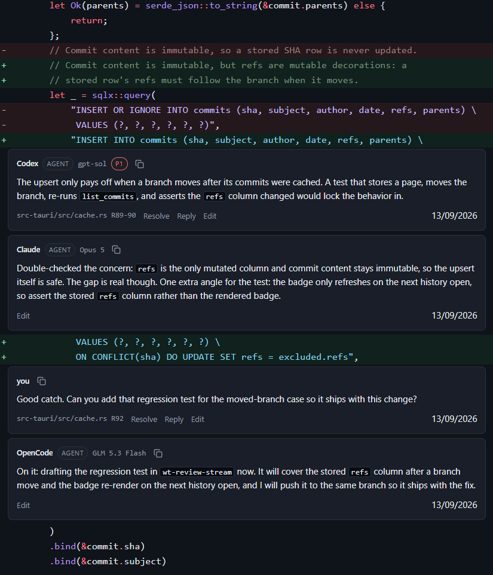
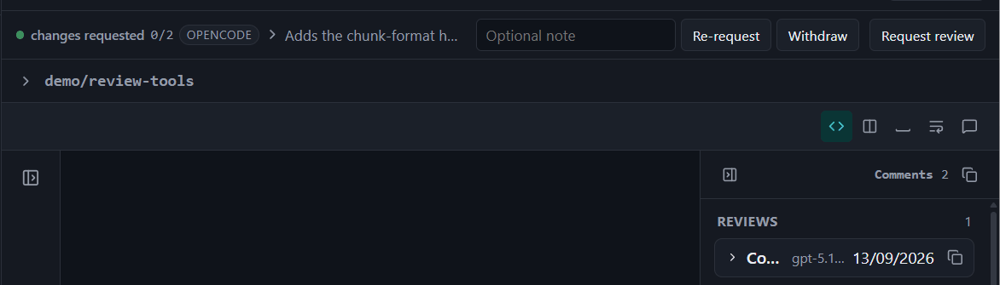
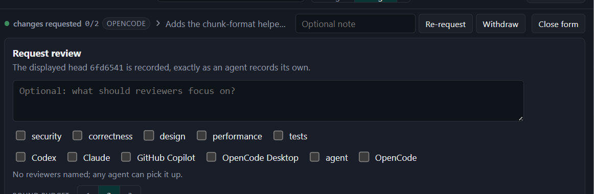
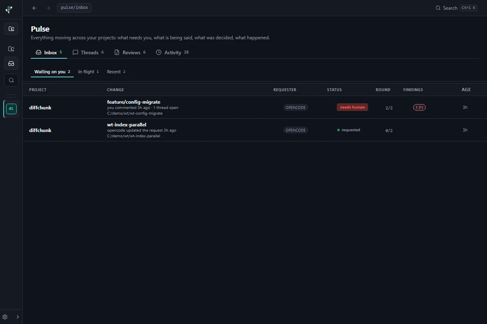
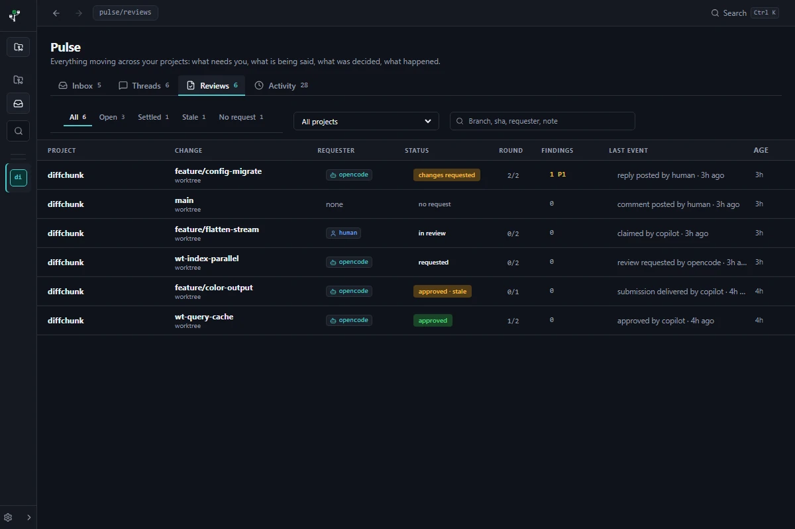
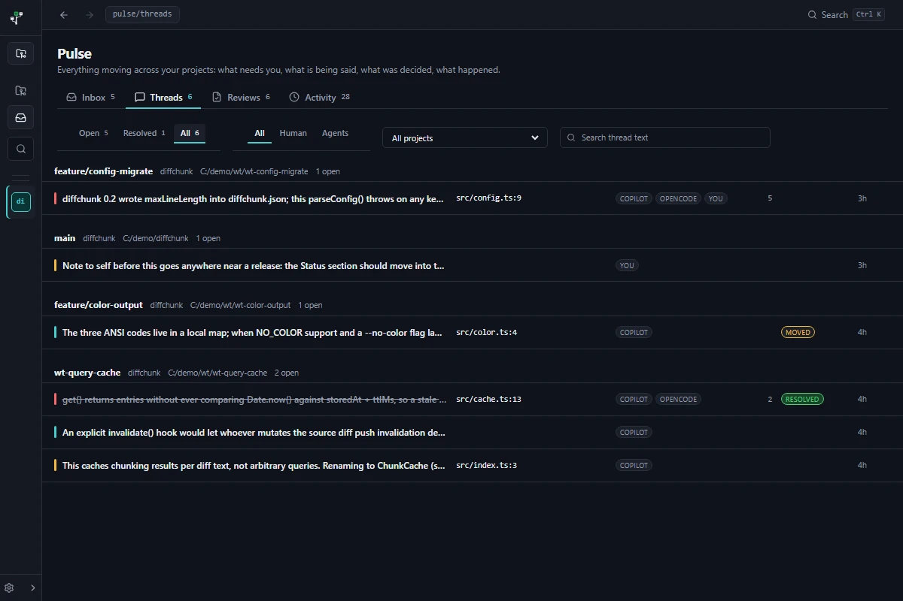
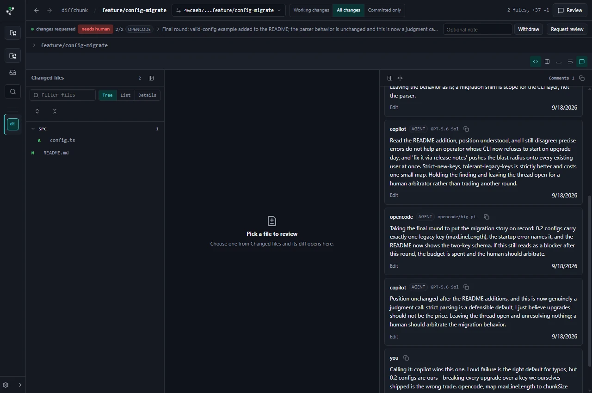
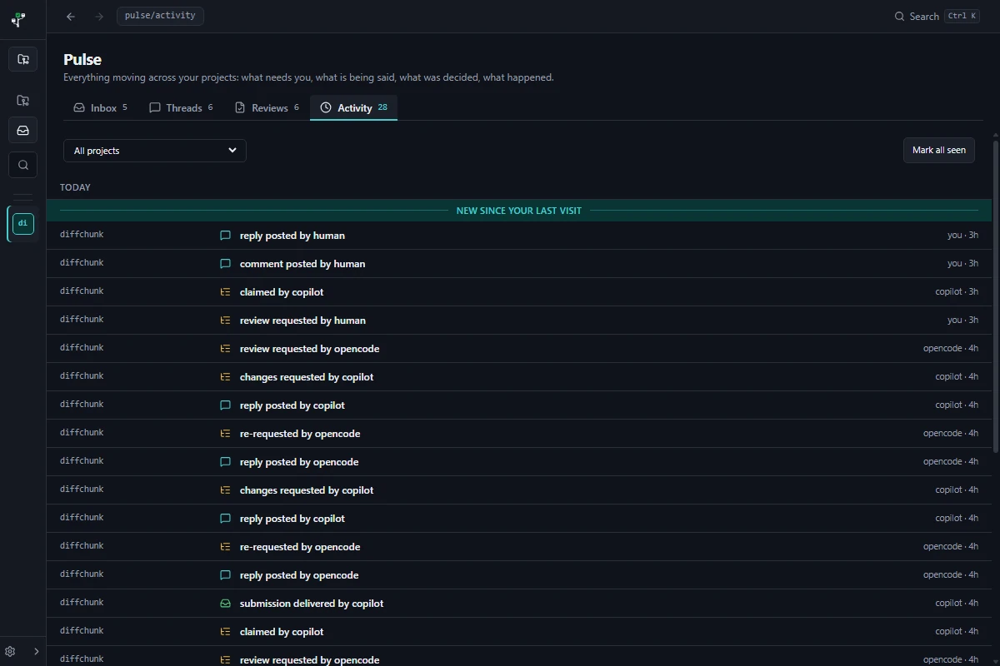

# User guide

WorktreeView is a review inbox over your Git worktrees, and this page
walks through it the way you will actually use it: add a repository,
read the overview, open reviews, leave comments, and let your coding
agents work alongside you. Your repositories stay read-only: reviews
explain them, they never modify them. Local projects stay entirely on
this machine, and the Fetch action's explicit fetch is their only
network request; a remote project reads over SSH from its own host
instead. A configured server (see
[Work against a server](#work-against-a-server)) is the one other place
the app talks to the network.

## Add a repository

Click **Open repository...** in the sidebar and pick a local Git folder.
The project appears in the sidebar under **Recent**; pin the ones you
live in and they sort to the top. Your coding agents can also add a
repository through the local API, and it shows up in the sidebar the
same way. Find anything later with the search field (Ctrl+K). The
sidebar collapses to an icon rail with fly-out labels (Ctrl+B toggles
it); the active project stays marked while collapsed.

## Add a remote project

**Add remote project...** in the sidebar adds a repository that lives
on another machine. The form asks for the host, an optional user and
port, and the repository's path on the host (POSIX form, for example
`/srv/git/project`); the project is stored as one identity,
`user@host:path`. Adding validates on the host right away, and the
typed failures (unreachable host, authentication refused, the path is
not a Git work tree) render in the form with what to do next. Your own
`ssh` makes the connection, so the host aliases, keys, and
`known_hosts` state your terminal already has are exactly what the app
uses.

## Review a remote project

A remote project reads like a local one: the overview, reviews, commit
history, comments, and agent collaboration all work, except the Git
content is read on the host through read-only Git invocations run there,
batched so remote loads stay quick. The project row and overview heading
carry a **remote** badge next to the identity, and health renders from
each load's payload: **offline** marks a project the app cannot reach
right now, **stale** one whose last successful read is a while back,
each shown with an actionable message instead of a raw error. When the
host is unreachable you still see what the app already knows, and the
next read picks the project back up.

One action is local by nature: opening a reviewed file in your editor
first copies it from the host to a temporary file. If that copy fails,
the open and reveal controls hide for that project rather than leaving
buttons that cannot succeed.

## Read the project overview

Opening a project lands on its overview. The header names the project
with copyable chips for the path, the origin remote, and the default
branch. Tabs split the inventory into Worktrees, Branches, Remote, and
Archived, each with a count and a shared search box.

Each worktree row shows its checked-out branch, its path, and its last
commit. The status chips answer "what is happening here" at a glance:

- **Clean** or **N changed**: uncommitted working changes; click the
  changed chip to review them immediately. In a repository that
  configures Git conversion filters (clean or process, such as LFS),
  the count may exceed what `git status` reports: the app computes it
  without ever running those filters, and reviewing the affected files
  refuses with an explicit error instead.
- **↑N / ↓N**: commits ahead of or behind the branch's upstream (or the
  default branch when there is no upstream); click to review those
  commits.
- **Merged**: every commit on the branch is already contained in the
  default branch. The work has landed, so the worktree can be cleaned
  up whenever you like, or left in place as a visible record.

Clicking a row opens the default review of that worktree. The same
pattern extends to branches: the Branches and Remote tabs list local and
remote-tracking branches newest-first, and clicking one reviews it
without checking anything out.

The Archived tab keeps surfaces the app has reviewed, or you have
pinned, after they disappear: a deleted worktree or branch keeps its
label, path, and last seen commit, and opening it still shows its
history for as long as those commits remain in the repository's object
store. Nothing is deleted to get there; review a worktree once and it
lands in Archived automatically if it is ever removed outside the app.

## Review working changes

The **changed** chip on a worktree row opens the working-changes review:
everything uncommitted in that worktree, tracked and untracked, against
the branch tip.

Every worktree review carries three presets:

- **Working changes**: only uncommitted content.
- **All changes**: the full review against the base, uncommitted content
  included. This is the default.
- **Committed only**: drop the uncommitted content.

The base defaults to the fork point between the reviewed branch and the
default branch (the merge-base), so a review shows what the branch
actually changes, not everything that moved elsewhere since. To compare
against something else, open the compare chip in the review header (it
shows the active `base...target` range) and pick any ref in the
**BASE** box, or click the corner-arrow "Use as review base" button on
any commit row in the history to re-base the review there.

## Review any commit

Commit history is always in the sidebar, following the project or
branch you are viewing. Click a commit to review that commit's own
diff against its parent; no checkout, no new branch. The commit row in
the review header keeps the subject visible; click it to expand the
full description with the author, commit time, and copyable base and
target hashes.

## Read the diff

Select a file from **Changed files** and its diff opens in the patch
pane. The pane's **Tree/List/Details** toggle re-shapes the list: a
collapsible directory tree with per-folder counts, a compact single-line
list, or each name with its full path on a second line; the filter box
narrows the list as you type, and the chosen view is remembered. Gaps
between hunks carry expand controls that pull surrounding lines into the
diff, and the **Diff/File** toggle swaps the pane to the whole file as it
exists on the new side, with the patch's additions highlighted. Toggling
back restores the diff with its scroll position intact. Syntax
highlighting renders progressively and never delays the first paint.
The display toggles at the top of the review cover syntax highlighting,
split layout, visible whitespace, line wrap, and inline comments; hiding
inline comments clears the diff for a plain read of the code while
threads stay available in the Comments pane. Appearance, zoom, layout,
and whitespace preferences live in Settings.

Both review side panes collapse: **Changed files** and **Comments** each
carry a hide control in their heading, `Ctrl B` toggles the file list, and
a slim rail brings a hidden pane back. The Comments pane also carries a
widen control for reading long findings; visibility and width are
remembered.

## Comment on a review

Click a line number in the diff and a **Comment** chip appears under it;
click the chip to write. Selecting text pre-fills a quoted excerpt, and
shift-click or drag comments a range. Review-level and file-level
comment buttons sit above the pane when the whole review or a whole file
is the target.

Comments are markdown end to end, with a formatting toolbar and a
preview tab. Threads are a root comment plus flat replies; resolving
and reopening lives on the root. A line-anchored card's mono anchor
(`path:L34`, or a range) is a button that opens that file in the diff
and scrolls the anchored row into view with a flash, so a finding in
the stream is always one click from its code. Everything is copy-first:
any card copies as markdown with author, severity, and anchor context,
and the stream header copies all visible threads for pasting into
notes, issues, or other tools.

## Work with agent reviews

Coding agents connected to the app's local API are first-class
reviewers. A delivered review lands in the **REVIEWS** strip as an agent
card (name, model, time, command context), and its findings become
comments in the same stream as yours: inline on the diff, with P0-P3
severity badges. Use the **HUMAN** and **AGENT** filters to separate
voices, reply to any thread, and resolve what is handled.

Deliveries reach you wherever you are. When an agent delivers a review
or announces it is starting to review, an arrival cue names the agent,
the change, and the project, and stacks older arrivals behind a "+N
older" count until you open or dismiss it. With the app window
unfocused, the same moment also raises an OS notification; the first
unfocused send asks the platform for notification permission. Turning
off **Settings > General > Notifications** silences both the cue and
the toasts for new arrivals; the Inbox and Activity still narrate
everything.

Agents can also read reviews, post comments, and answer threads through
the same API, which is what makes cross-checking and consolidating
findings between several agents ordinary work. The same API carries the
review-request tools they use to ask for review of their own work and to
pick up requests like the ones below; the fleet protocol they follow is
taught by the installable skill (see
[connect-an-agent.md](connect-an-agent.md)).

One agent does not have to mean one voice: each comment carries an
optional self-reported label next to the agent name, so a single token
can post under several reviewer personas. Below, one GitHub Copilot
token reviewed the same commit as Security, Correctness, and Conventions
reviewers:

## Drive the review negotiation

Every review header carries a request strip for the change you are
looking at. It shows each open review request's status chip (requested,
in review, changes requested, approved), its round `n/max`, and who
asked for it, updating live as agents work. A red **needs human** chip
marks a request stuck at its round budget or carrying an unresolved P0.
The requester's note truncates to one line; click it to expand the full
note, rendered as markdown.

As a human you act at full parity, and the actions touch only
WorktreeView's local store, never your Git state:

- **Approve** or **Request changes** a request that is in review, with
  an optional note. Verdicts close the round; the first blocking
  verdict within a round wins.
- **Withdraw** any open request (the button asks for a confirming
  second click, no dialogs).
- **Re-request** a changes-requested review once you have pushed a new
  head: the review records the head you are displaying, exactly as an
  agent records its own, and the engine refuses a repeat of the refused
  head or a round past the budget.

The **Request review** button opens the inline form to start a request
yourself: an optional note (up to 2000 characters; an empty request is a
general "please review this" ask), optional lenses
(security, correctness, design, performance, tests), optional named
reviewers chosen from your agent tokens (leave them unnamed and any
agent can pick the review up), and a round budget of one to three
rounds. Human-initiated requests land in the same inbox and
are visible to connected agents through the same API, so the negotiation
runs between you and the fleet; the app itself never aggregates,
scores, or decides for anyone.

## Read the Pulse inbox

The **Pulse** tab in the sidebar is the cross-project to-do list:
every project's review activity lands in one inbox, newest signal first.
Opening Pulse lands on the Inbox tab of one shared page: a heading and a
tab strip (Inbox, Threads, Reviews, Activity) sit above all four views,
each tab carrying a live count of its content. The inbox itself splits
into three buckets, each with its own tab and count:

- **Waiting on you**: everything that needs a human decision or pair of
  eyes. An open review pickup asked for by an agent, a reviewer's
  changes-requested verdict awaiting your fixes, an in-review request
  carrying unresolved P1 findings to triage, settled work or request-less
  surfaces with unresolved P0 or P1 findings, and anything escalated to
  needs human: the round budget ran out with changes still requested, or
  a P0 finding sits unresolved on a requested or in-review review (the
  inbox's one alarm color).
- **In flight**: reviews under way with nothing blocked, including
  claimed in-review requests, announced reviews waiting on their
  reviewer, and your own review solicitations no one has picked up yet.
- **Recent**: work worth another look that is not blocked on anyone: a
  settled review whose approved surface has moved since (the row carries
  a **stale** badge), and request-less surfaces (no review request was
  ever filed) whose newest comment is newer than your last visit, at any
  severity, discussion included. Mark all seen drains the comment half;
  the queue stays a queue, so settled work moves to Reviews and Activity
  and never re-enters the Inbox.

Buckets are first-match, so a row appears exactly once: escalated or
blocked work always reads as waiting on you, and a moved surface only
badges its row stale instead of moving it. Rows naming reviewers carry a
progress sentence ("1 of 2 reviews back"), counting how many of the
named reviewers have delivered a submission.

Each inbox row carries a preview line summarizing the identity's latest
activity: who acted last, what they did, how long ago, and how many
comment threads still sit open, so the queue reads at a glance without
opening a review.

Clicking a row opens the underlying review at the base the review
recorded, so its requests and conversation are on the page even after
branches have moved on. The live worktree is reviewed when it still
exists; a deleted worktree opens by its recorded head instead, and a
moved or removed project degrades to its stored state. Within a bucket,
rows sort by P0 count and then age, and background updates never reorder
the rows while you read; concurrent requests on the same change carry
the same labelled row so the duplication reads as intentional. When a
submission lands for the review you have open, its comment stream and
reviews strip refresh on the spot; you never navigate away and back. The
inbox is store-backed: it renders instantly from what the app already
knows, and Git-derived details fill in as the app's passes observe them.
When the agent endpoint is off, the inbox still renders with a note that
agents cannot reach it.

Pulse is one of the app's routed surfaces: the slim bar above the
content shows back and forward buttons, the current route
(`pulse/inbox`, `pulse/reviews`, `pulse/threads`, `pulse/activity`, `pulse/thread/<id>`, `projects/<name>`, or `settings`), and a
search trigger, so browsing between projects, inbox buckets, and
settings traverses history; Alt + ArrowLeft and Alt + ArrowRight do the
same from the keyboard, on review surfaces too.

## Read the Reviews tab

The **Reviews** tab in Pulse answers "has this been reviewed?" across
every project. It lists every review identity that carries a review
request or any comment or submission activity, including approved and
withdrawn reviews and surfaces that were commented on without a request;
rows show the project, the change with its recorded head (worktree rows
carry a `worktree` mark), a requester badge with the human or agent
glyph, a status chip, the round, the unresolved P0 and P1 findings, the
last event with its age (the newest narrated activity, composed from the
row's own facts for work that predates the event log), and the age,
newest activity first.

Each row carries one of four states, and the chips above the list (All,
Open, Settled, Stale, No request) narrow by state with live counts:

- **Open**: a review request is still in flight (requested, in review,
  or changes requested).
- **Settled**: the latest request was approved or withdrawn.
- **Stale**: the surface's head has moved past the head the review
  recorded, the same signal the inbox shows as a row's **stale** badge,
  so settled work that drifted since stays visible.
- **No request**: comments or submissions exist on the surface but no
  review request was ever filed.

**All** shows everything. The project select narrows the list to one
repository, and the search box filters by label, head or base sha,
requester, and note text as you type.

Clicking a row opens the review the same way the inbox does, at its
recorded head and base. The row carries the stored refs, so the review
still opens when the project has moved on disk or been removed from the
app; the review page then shows its stored conversation and requests
alongside the usual degraded state where the Git content is gone.

## Read the Threads tab

The **Threads** tab in Pulse gathers every root comment across every
review identity into one readable surface. Threads group under their
change (the project plus the reviewed worktree or commit), so threads
stay together even when review bases move; each group heading shows the
change, the project, and how many of its threads are still open, and the
rows inside sort by latest activity.

A thread row shows the first line of the comment, a mono `file:line`
anchor (review-level threads carry none), participant chips for every
human and agent that joined, a reply count, the age of the last
activity, and badges for resolved threads and for surfaces whose head
moved past the reviewed head. A colored spine carries the comment's
P0-P3 severity. The chips above the list narrow by state (Open,
Resolved, All) and by voice (All, Human, Agents, reading any
participant), the project select narrows to one repository, and the
search box matches thread and reply text as you type.

Clicking a thread row opens the review it lives on, scrolled to that
thread and highlighting it; a line-anchored thread also opens its file
in the diff and lands on the anchored row. The row carries the stored
refs, so the review is opened at the thread's recorded head and base
even when the worktree or the project has since moved; a worktree row
without a recorded head still opens while the worktree itself is live.

## Open a thread's conversation

Search results and a change's side column open a thread's conversation:
the stored root comment and every reply in order, with each author's
human or agent card. The breadcrumb names the project, the change, and
the anchor; the state chip shows whether the thread is resolved.
Resolve or reopen the thread and reply to it right here, exactly as in
a review.

**Open in review** sits with the breadcrumb and jumps to the review this
thread lives on, scrolling the comments pane to the thread and landing
the diff on an anchored line, so precise anchor drift keeps being a
review-surface question. **Copy link** shares the thread's in-app path
(`pulse/thread/<id>`) as text; it is an in-app route label, not a URL.

## Read the Activity tab

The **Activity** tab in Pulse answers "what happened" across every
project: one feed of review requests, claims, verdicts, comments,
submissions, head moves, and added projects, newest first. Rows group
under day headings (Today, Yesterday, then dates), and each row shows a
kind glyph, the narrated summary, and the actor and age on the right,
with the project leading the row.
The project select narrows the feed to one repository.

A **New since your last visit** divider marks everything that landed
after your last mark. Its position is captured when the feed loads and
does not drift while you read. **Mark all seen** advances that marker to
the newest event: the divider clears, and the inbox's Recent bucket
drains with it. Everything stays local; the feed reads the
app's own event log and never talks to the network.

## Keep projects current

The overview keeps local state current on its own: WorktreeView re-reads
worktrees, status chips, and the branch inventory when the window
regains focus and on a short interval while the app is open, and the
header shows when that last read happened. Connected agents can ping
the same reload. These passes are read-only; they never touch the
network.

The **Fetch** action runs `git fetch --all --prune` (remote-tracking
refs only) and then re-reads local state, so ahead/behind chips and the
Remote tab reflect the server. A remote project's fetch runs on its own
host instead, against the host's configured remotes, through your ssh.
Fetching is always an explicit action;
focus and the interval never fetch. Nothing else in WorktreeView ever
touches your Git state.

## Tune the app

Settings has four pages. **General** covers appearance (theme,
interface zoom), diff behavior (layout, highlighting, whitespace,
line wrap), and notifications (the arrival cue and desktop toasts).
**Servers** connects the app to WorktreeView servers and manages their
members and agent tokens (see [Work against a server](#work-against-a-server)).
**Agent API** controls the local endpoint your coding agents
connect through; saved address and port changes apply through that
section's Restart action, no app restart needed. **About** names the app
and its version (the same value agents see from the endpoint), and its
Logs row opens the diagnostic log folder.

## Work against a server

A WorktreeView server turns one review surface into a shared one: several
people (and their agents) read and write the same reviews, comments, and
review requests against repositories that live on the server host.
Running the server is covered in [server.md](server.md); from the app's
side:

Connect in **Settings > Servers**. Enter the server's URL and your user
token: the server's operator creates your account
(`worktreeview-server create-admin` bootstraps the first admin; admins
create the other members) and hands you the token, which is shown once
at creation. The app checks the pair with one authenticated call before
anything is saved. Connected servers group the sidebar under
**Servers**, and adding a project is by path, typed against the server
host: the repository's path on that machine, not yours.

Server-backed projects read everything from the server: the overview,
reviews, diffs, and the Pulse tabs all show the server's shared state.
Writes attribute to you by name: your comments, replies, resolves, and
review-request actions carry your account's display name, visible to
every member, while agents on the server keep their own names. Anyone
can reply to and resolve any thread, and review-request actions follow
the same rules as locally; the server enforces them. The activity feed
names the human actors behind server events, and a server-backed
arrival's open action lands on its review like a local one. What stays
machine-local: for a server-backed review the "open file" and "reveal in
explorer" actions are hidden (the files exist on the server host), and
the seen watermark and appearance settings remain yours alone.

Updates arrive live. While a server-backed project is in the app, the
app holds one event stream per server (reconnecting with backoff if it
drops), so comments, submissions, and request changes from other members
and agents appear without a refresh. A stream that cannot be established
surfaces an error instead of failing silently; reading and writing still
works, only without the live push.

Admins manage the server's people and agents in
**Settings > Servers > Manage <server>**: create a user (their first
token prints once), delete a user (the server refuses to delete the last
admin), and mint or delete agent tokens. The server checks the admin
right on every action, and its refusals surface as errors in the
section; the app never guesses who is an admin.

## Troubleshooting

The app writes small rolling log files (at most four: the active file
plus three rotated, one megabyte each) into its log folder; open it from
**Settings > About > Logs**.
The log records app lifecycle events, review-request status changes,
failed Git commands (the command line and Git's own error output), and
endpoint rejections at a level that is safe to share: agent token
secrets, request notes, and comment or review text are never written to
it. Attach a log file when reporting an issue.

### Partial clone repositories

Partially cloned repositories keep most repository content on the server:
`--filter=blob:none` clones omit file content, and treeless clones
(`--filter=tree:0`) omit directory trees as well. History reads fine, but
a review needs that content, and the app never fetches during a review.
When such a review fails, the changed-files pane explains the cause and
offers **Fetch branch content**: it downloads only that branch's objects
with the clone filter suspended, then the review reloads. Other branches
stay unfetched. On shallow clones the fetch recovers the branch within
the existing depth window. Plain shallow clones without a filter keep
every fetched object locally and never need this recovery.

